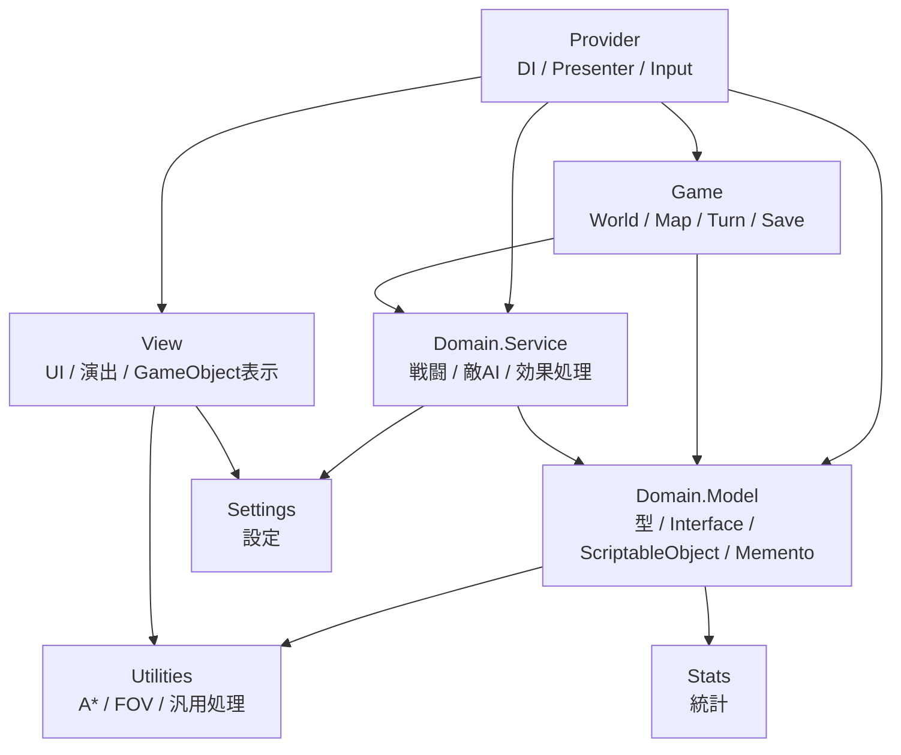
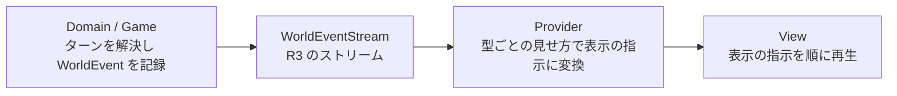

# LogRogue Architecture

[READMEへ戻る](../README.md)

LogRogue では、ゲームルール、進行管理、表示、入力、データ定義を分離し、依存方向が大きく崩れないように Assembly Definition で制限しています。

基本方針は、**データ定義やインターフェースを内側に置き、外側の実装が内側の定義に依存する**構造です。

---

## Layer Overview

`Provider` は、DI や Presenter を通じて各層を接続し、WorldEvent を表示の指示へ変換する合成ルートです。  
`View` は UI、演出、GameObject の表示制御と、表示の指示の再生を担当します。  
`Game` は World、Map、Turn、Save など、ゲーム全体の進行を管理します。  
`Domain.Service` は、戦闘、敵AI、効果処理、マップ処理などのゲームルールを実装します。  
`Domain.Model` は、型、インターフェース、ScriptableObject、Memento などのデータ定義を持ちます。  
`Utilities`、`Stats`、`Settings` は、複数の層から利用される共通基盤です。

---

## Dependency Policy

依存方向は Assembly Definition によって制限しています。

特に、次のような依存を避けています。

- `Domain.Model` が `Game` や `View` を参照しない
- `Domain.Service` が `GameObject` や UI に依存しない
- `Game` が `View` を直接操作しない
- `View` が `Domain.Model`、`Domain.Service`、`Game`、`Provider` に直接依存しない

これにより、敵AI、効果処理、ターン進行などの中核ロジックが、Unity の表示処理や UI に引きずられないようにしています。

---

## Provider as Composition Root

`Provider` は、入力、Presenter、DI コンテナなどを通じて、`View`、`Game`、`Domain.Service`、`Domain.Model` を接続する層です。

VContainer を使い、GameManager、Presenter、WorldEvent の変換、デバッグコマンドなどを登録・注入しています。

この層に接続処理を集めることで、各機能が互いに直接参照しすぎないようにしています。

主な実装：

- [Container.cs](../Assets/Scripts/Provider/Container.cs)

---

## WorldEvent

ロジックと表示は、WorldEvent だけでつないでいます。

### 記録

ゲームルールは、状態を変えたその場で WorldEvent を記録します。WorldEvent は、移動・攻撃の命中・状態異常・所持品の変化・店の精算額の変化など、約70種類あります。

WorldEvent には、何が起きたか（差分）と、変化後の値の両方を載せています。表示側は、届いた WorldEvent だけで画面を更新でき、ロジックの状態を読みに行く必要がありません。キャラクターの出現やマップへの入場も WorldEvent として記録し、その時点の状態をまとめて載せています。

ロジックは演出の終了を待たずにターンを解決し、WorldEvent を記録して先へ進みます。

### 変換と再生

Provider は、WorldEvent の型ごとに「見せ方」を1つずつ用意しています（1種類1ファイル）。WorldEvent が届くと、型から見せ方を1回引き、表示の指示（約50種類）の列に変換します。種類ごとの分岐を書かずに済み、新しい WorldEvent を足すときは見せ方を1つ足すだけです。

View は、表示の指示を順に再生します。同じキャラクターの演出は前のものが終わるまで待ち、別のキャラクターの演出は並べて再生します。歩行の演出が溜まったときは、早送りで追いつきます。

画面のログ・BGM の切り替えも、見せ方の中で WorldEvent から作っています。プレイ統計も、同じ WorldEvent を数えて集計しています。

### この設計にした理由

ローグライクの1ターンでは、多くのキャラクターが続けて動きます。ロジックが演出の終了を待ちながら進むと、敵が多い場面ほどテンポが落ちます。また、「いつ何を見せるか」という表示の都合が、ゲームルールの中に入り込みやすくなります。

ロジックを演出から切り離したことで、ゲームルールはそれだけで完結し、演出の長さや見せ方を変えてもルールには手を入れずに済みます。表示側も、届いた WorldEvent だけを見ればよいので、ロジックの実装の変更が表示へ広がりません。

主な実装：

- [WorldEvent.cs](../Assets/Scripts/Domain/Model/WorldEvents/WorldEvent.cs) /
  [WorldEventStream.cs](../Assets/Scripts/Domain/Model/WorldEvents/WorldEventStream.cs)
- [WorldEventTranslator.cs](../Assets/Scripts/Provider/Presentations/WorldEventTranslator.cs) /
  [WorldEventPresentations.cs](../Assets/Scripts/Provider/Presentations/WorldEventPresentations.cs)
- [PlaybackQueue.cs](../Assets/Scripts/View/Playback/PlaybackQueue.cs) /
  [ViewOp.cs](../Assets/Scripts/View/Playback/ViewOp.cs)

---

## Difficulties and Design Choices

### 1. Unity の GameObject へ依存しすぎないこと

Unity では、MonoBehaviour や GameObject を中心に実装すると、ロジックと表示が密結合になりやすいです。

しかしローグライクでは、敵AI、視界計算、効果処理など、表示に依存しないロジックが多くあります。

そのため、ゲームルールはできるだけ `Domain.Service` や `Game` 側に置き、  
`View` は表示と演出に集中させるようにしました。

### 2. 分離しすぎによる実装コスト

層を細かく分けすぎると、個人開発では中間層や変換処理が増えすぎる問題があります。

そのため、すべてを理想的に抽象化するのではなく、  
`Provider` に接続処理を集めることで、依存関係を整理しつつ実装コストを抑えています。

### 3. データ駆動と型安全性の両立

アイテム、敵、スキル、フロア設定は ScriptableObject や専用エディタから調整できるようにしています。

一方で、スキルや効果は種類が多く、単純な enum や固定クラスだけでは拡張しにくくなります。

そのため、`SerializeReference` を使い、効果、範囲、発生位置などをポリモーフィックに組み合わせられるようにしています。

これにより、データ側で試作しやすくしつつ、コード側では共通インターフェースを通じて処理できるようにしています。
